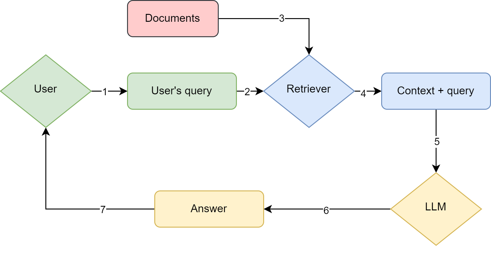

# RAG examples using Langchain. 
### Influenced by the short course *LangChain Chat with Your Data* from **DeepLearning.AI**.
Visit https://learn.deeplearning.ai/courses/langchain-chat-with-your-data.

---

As a brief definition for those who do not know RAG (Retrieval Augmented Generation) yet, this concept refers to providing additional information from documents to a large language model (LLM) for improving its responses and even using real time data instead of up to their cutoff knowledge date. 

RAG works by dividing the documents into smaller chunks, which are embedded and uploaded into a vector database. From there, every query from the user is compared with the chunks with similarity techniques which can be further enhanced depending on the situation. Ideally, the retrieved chunks provided as additional context improve the LLM outputs. The image above represent the flow of a basic RAG system. 

This notebook starts with experiments on RAG. At the end of the notebook there is the possibility of having a conversation with a chatbot powered with documents that allows users to see in depth the chunks retrieved as well as its metadata.

The chatbot and the experiments rely on the documents from the *docs* folder, which can be changed for others as long as they are also uploaded in the vector DB by manually modifying the code in the Jupyer notebook. Not only those, but also URL can be used to increased the data stored (see an example in the notebook).
 
### **Structure**:
This repository consists of the following:
- A Jupyter notebook, *talk_to_docs.ipynb*
- The *docs* folder, which contains some documents to be used and the vector DB on which the embedded chunks will be loaded.
- Another folder (*examples*) containing images for displaying interactions with the chatbot.
- The *requirements* folder with the Python libraries and packages necessary.
- Additionally, a *.env* with the variable **OPENAI_API_KEY="sk-XXXX..."** should be created by the developer to access the OpenAI models through the API.

### **Usage**:  
 - Install the Python packages and libraries from the *requirements.txt* or *environment.yml* file in the *requirements* folder
 - A *.env* file must exist at the root of the directory and it must have the appropriate values (OPENAI_API_KEY="sk-XXXX...") for the correct functioning of the code.
 - Run chunk by chunk the notebook to see the results of the experimentation. In case you want to load other documents, use the *load_url*, *load_pdf* and *load_txt* for their respective format. Then add the new loaded documents into the *docs* list variable and continue with the experimentation. After adding the loaded documents in the *docs* variable, you may jump directly to the chatbot if you prefer. 

#### **Note**:
 - **The OpenAI API is used, which requires and OpenAI account and calling it has associated costs.**
 - **The Python version is 3.11.0.**
 - **Conda 24.1.2 was used for the generation of the environment and the development of the app.**
 - **This work is part of my Master's Thesis.**
  
--- 

Screenshot of the user interface:

